# HeatWalk — screenshot record

Captured 2026-08-27 against the local dev build (`npm run dev`, Vite on `localhost:5175`) with fixture data already staged at `web/public/data/` (6 analyzed OCPS schools) and the self-hosted basemap at `web/public/heatwalk-aoi.pmtiles`. No source file was changed to produce these; every shot is the app as it runs today.

Viewport: browser window requested at 1440×900; the extension's screenshot capture returned images at 1568×772 (a fixed scale factor applied by the capture tool, not a layout change — verified via `window.innerWidth`/`innerHeight`, which reported 1920×945 for the underlying page). All 20 screenshots share this same scale, so they're directly comparable to each other. Theme is light except two shots (07, 17) that sample dark mode explicitly.

Two pin placements (screenshots 04–06 and the AOI test in 05) were positioned by calling `map.project()` / driving the MapLibre marker directly from the console rather than pixel-perfect mouse dragging, because the target coordinates (a red-classified block, and a point outside the AOI bbox) needed to be exact. This is equivalent to a user dragging the pin there — the app's own `dragend` handler fired and drove every downstream state change (routing, classification, panel content) exactly as it would from a real drag.

---

## Parent mode (`/`)

### 01 — Default view, address input
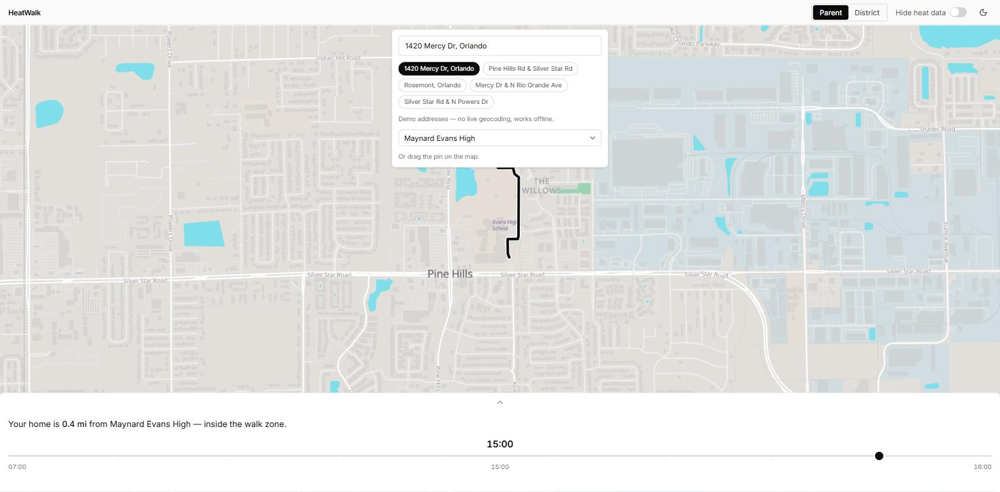

Landing state at `1420 Mercy Dr, Orlando` against Maynard Evans High. Shows the five demo-address chips and school selector (**FR-1**), both school boundaries rendered on the map (**FR-7**), and the bottom sheet in its collapsed "peek" state with the status sentence (**FR-2**) and hour slider (**FR-13**) visible.

### 02 — Route comparison panel
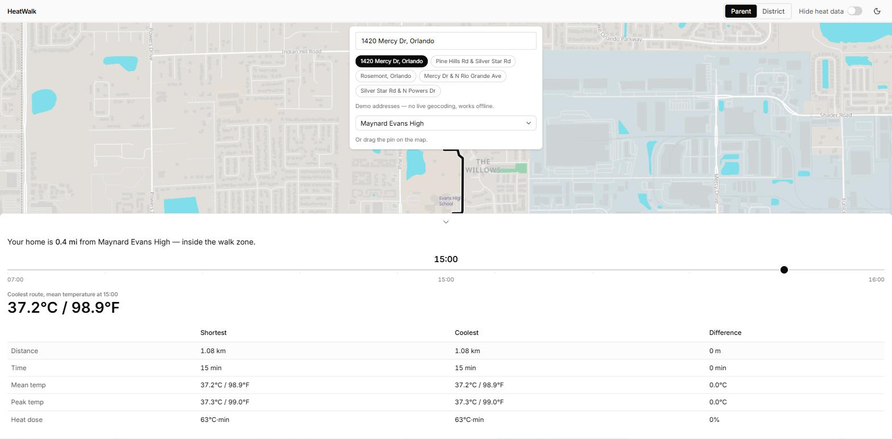

Bottom sheet expanded (tap the chevron) to reveal the shortest-vs-coolest route table (**FR-4**): distance, time, mean/peak temperature in paired °C/°F, and heat dose in °C·min. For this address the two routes coincide (0% difference), which is reported as-is per the project's honesty rule rather than dressed up.

### 03 — Hour slider changes the numbers live

Same address, slider dragged to 08:00. Mean temperature drops from 37.2°C/98.9°F (15:00) to 29.4°C/84.9°F, and heat dose falls to 0°C·min — confirms **FR-13** actually recomputes the panel rather than being decorative.

### 04 — Red block: no safe route + petition
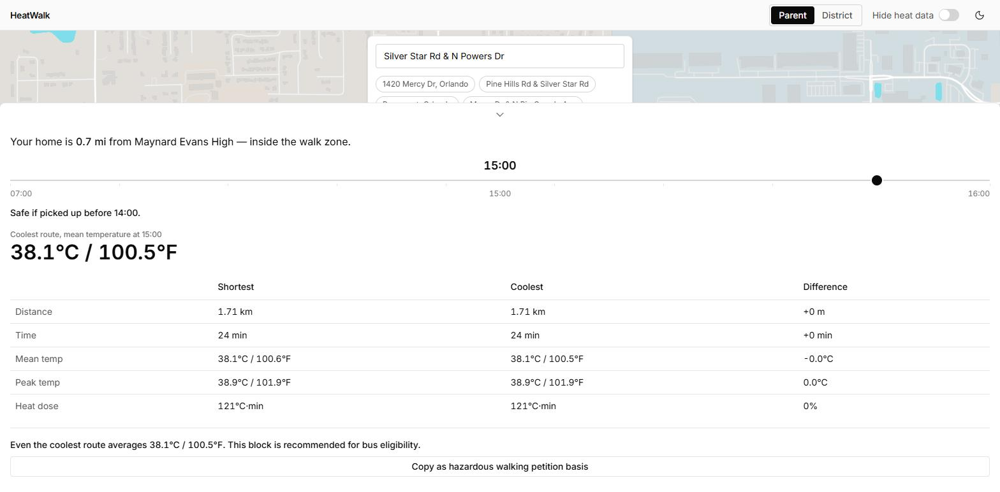

Pin moved to a block 0.7 mi from the school that pipeline output classifies **red** (`sch_maynard_evans_high`, block `120950120002004`, currently walked, `status_rec: bus_eligible`). Shows the `SafeUntilLine` ("Safe if picked up before 14:00", **FR-13**/derived from FR-8), the coolest-route heat dose of 121°C·min, the "even the coolest route..." line, and the **Copy as hazardous walking petition basis** button (**FR-5**). This is the case CLAUDE.md marks as never-cut: a red category with a populated, non-empty result.

### 05 — Outside the AOI
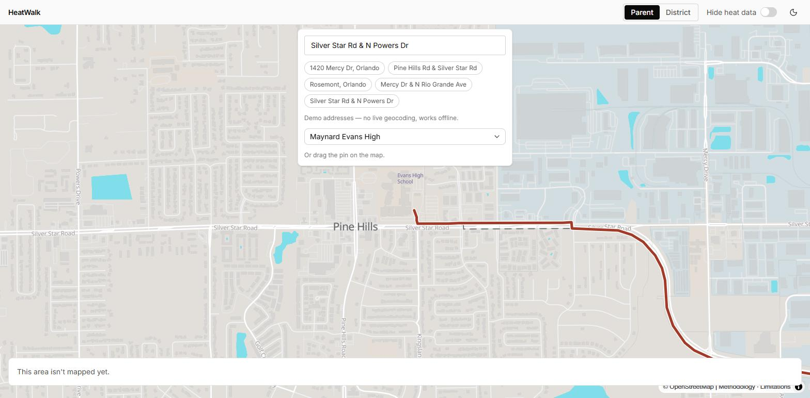

Pin dragged east of the analyzed tile boundary. The dashed AOI outline renders correctly and the app shows "This area isn't mapped yet." (`OutOfAoiNotice`) instead of guessing — confirms the AOI coverage boundary (**FR-21**-adjacent) gates the rest of the UI honestly.

### 06 — Hide heat data (FR-16)
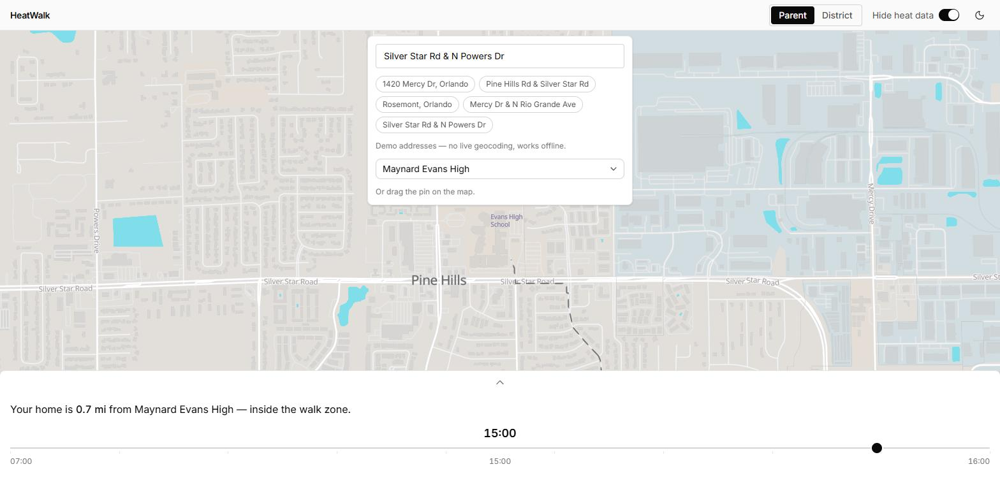

Same red-block pin as #04, "Hide heat data" toggled on in the header. The colored dose zone and route contrast collapse away, leaving the plain OSM-style basemap — this is the "kill switch" required to never be cut per CLAUDE.md.

### 07 — Dark theme
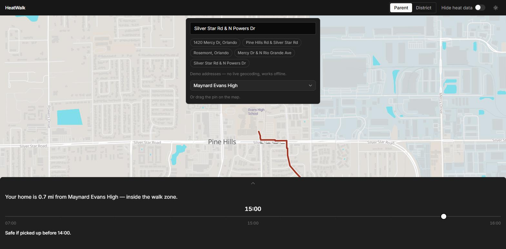

Theme toggle switched to dark. Panel chrome, text, and the AOI/route line invert correctly. Note: the basemap tiles themselves stay in the light Protomaps theme in both modes (`lib/basemapStyle.ts` hardcodes `namedTheme('light')`) — this is a real, current limitation, not a screenshot artifact.

---

## District mode (`/district`)

### 08 — Default three-column layout
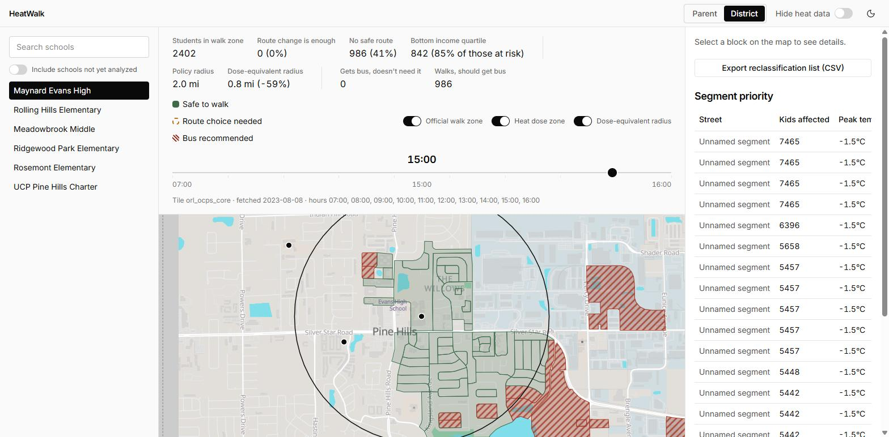

`Maynard Evans High` selected. Left: school list (**FR-6**). Top strip: school summary row (**FR-12** — 2,402 students in zone, 986 no-safe-route, 842 lowest-income-quartile, 0.8 mi dose-equivalent radius vs 2.0 mi policy radius — **FR-18**), zone legend (**FR-8**), three layer toggles, hour slider. Right: CSV export button (**FR-14**) and the segment priority table (**FR-15**). Map shows the dose-equivalent radius circle and red hatched blocks.

### 09 — Block detail panel (red block selected)
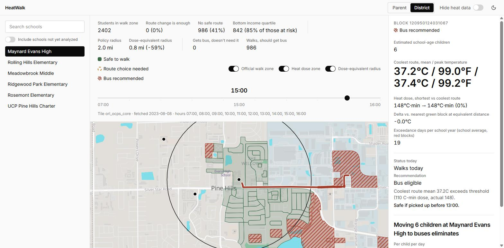

Clicked a red hatched block near the school. Shows `BlockDetailPanel` (**FR-9**): estimated children (6), coolest-route mean/peak temp, heat dose (148°C·min, unchanged shortest vs coolest), delta vs nearest green block, and exceedance days per year (**FR-19**, 19 days). The coolest route is drawn on the map in red to match "even routing can't fix this" (**FR-10**).

### 10 — Quantitative outcome panel
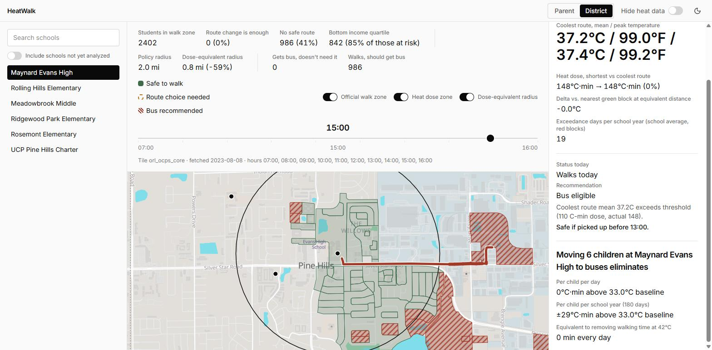

Scrolled down within the same block panel: the "Moving 6 children ... eliminates" outcome block (**FR-11**) — dose eliminated per child per day/year against the 33.0°C baseline, and equivalent minutes of walking-time removed at 42°C.

### 11 — Hour slider reclassifies blocks live
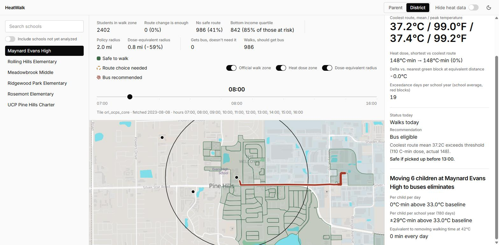

Same school, slider moved to 08:00. Every previously red/hatched block turns green and the summary strip's counts implicitly change — demonstrates **FR-13** driving the classification layer, not just a number.

### 12 — Layer toggle: dose-equivalent radius off
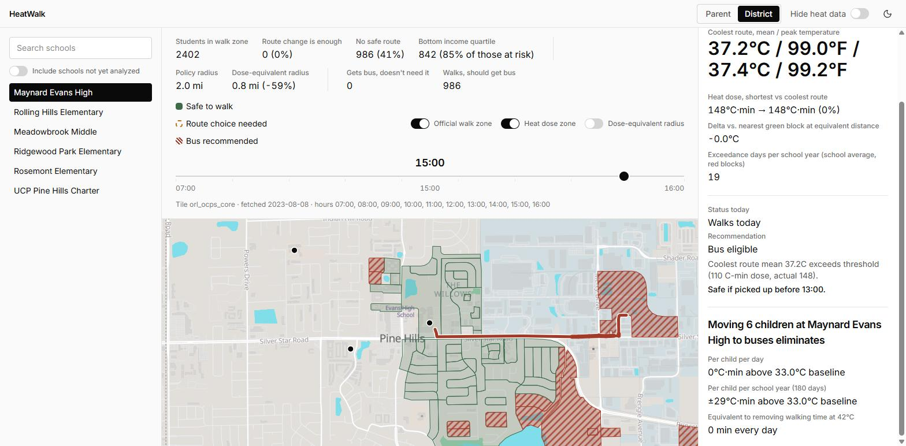

"Dose-equivalent radius" toggle switched off; the black 0.8 mi circle disappears while the hatched red blocks and official-zone/heat-dose layers remain. Confirms the three layer toggles are independent, real map layers (**FR-18** rendering), not one bundled switch.

### 13 — School search with unanalyzed schools included
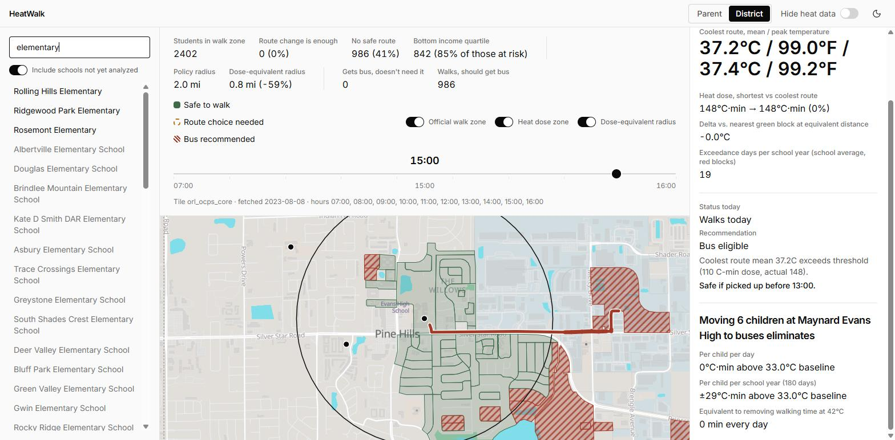

Typed "elementary" with "Include schools not yet analyzed" on. Bold rows (Rolling Hills, Ridgewood Park, Rosemont) are the three analyzed elementary schools; the plain rows below are unanalyzed NCES schools pulled in nationally (**FR-20**), capped and filtered by the same search text.

### 14 — Unanalyzed school notice
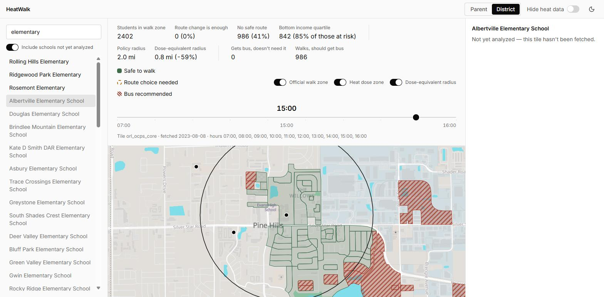

Clicked "Albertville Elementary School" from the unanalyzed list. Detail panel correctly shows "Not yet analyzed — this tile hasn't been fetched." instead of fabricating numbers — this is the honesty guarantee for the 99.9% of US schools that only exist as NCES pins.

### 15 — National school pins, zoomed out
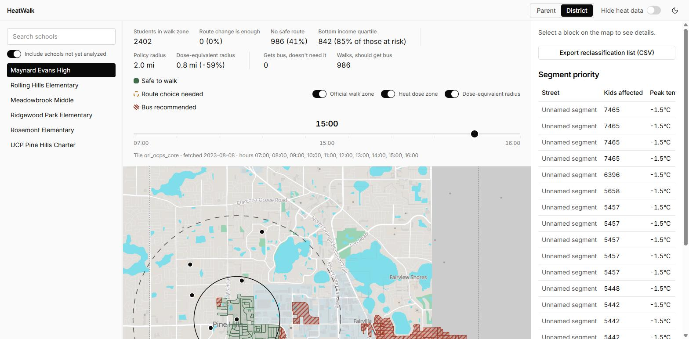

Camera pulled back to ~zoom 12.3 (still inside the AOI's basemap tile coverage). Multiple black school-pin dots visible north of Pine Hills alongside the dashed AOI boundary — this is **FR-20**'s national layer at a wider view than the default fly-to.

### 16 — Hide heat data (district)
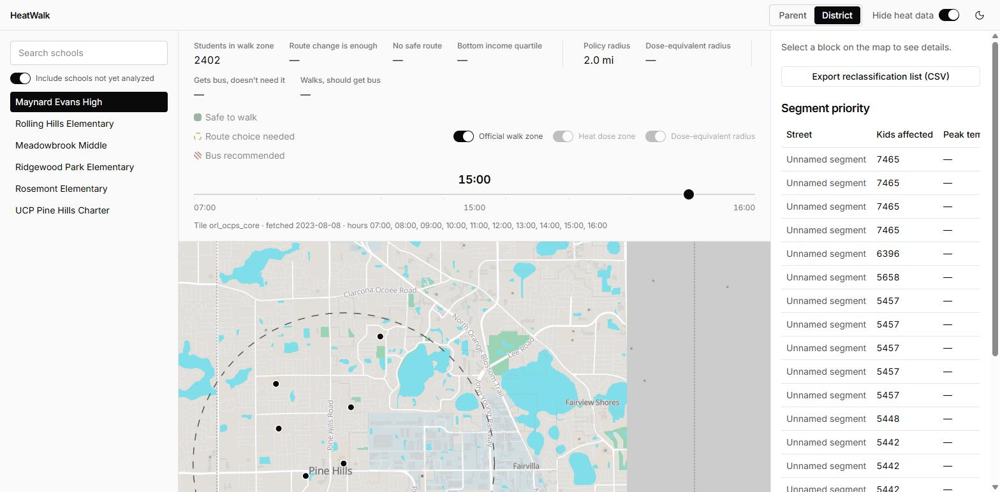

"Hide heat data" toggled on. Heat-dose-zone and dose-equivalent-radius toggles grey out and disable, the summary strip's heat-derived numbers (no-safe-route, bottom-income-quartile, dose-equivalent radius, segment peak temps) all replace with em dashes rather than stale numbers — confirms **FR-16** is wired through the whole district view, not just the map.

### 17 — Dark theme (district)
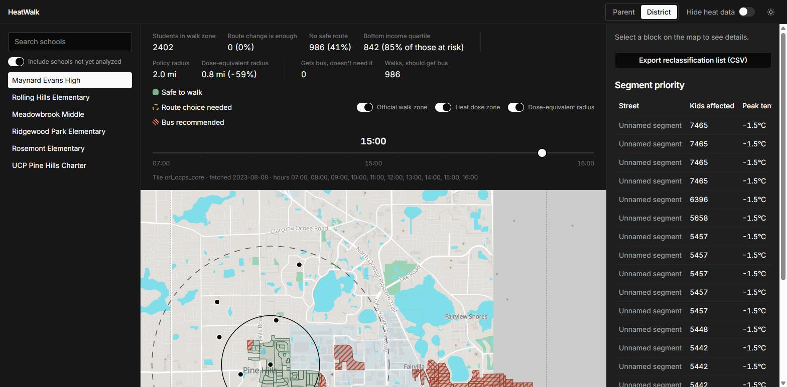

Same wide view as #15/16, dark theme. All panel and table text is legible; as in #07, the basemap tiles stay light-themed underneath.

---

## Documentation pages

### 18 — Methodology
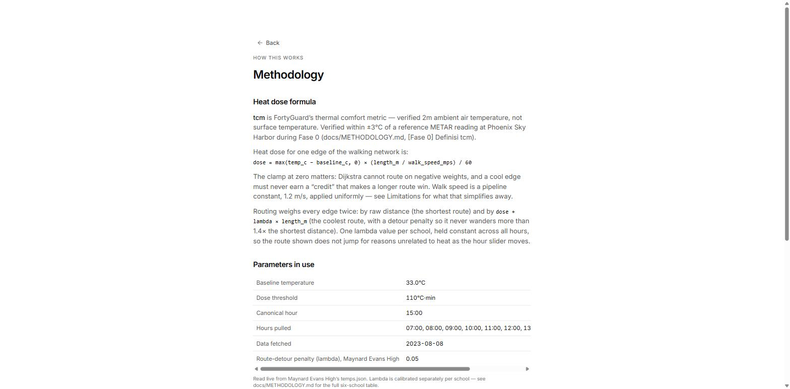

`/methodology`: the dose formula (`dose = max(temp_c − baseline_c, 0) × (length_m / walk_speed_mps) / 60`), the routing weighting explanation (detour penalty λ, capped at 1.4× shortest distance), and the live parameter table (baseline 33.0°C, threshold 110°C·min, canonical hour 15:00, λ = 0.05 for this school) — pulled from `temps.json`, not hardcoded in the page.

### 19 — Limitations (collapsed)
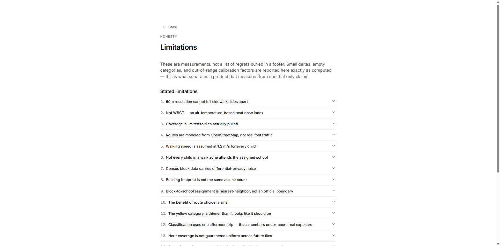

`/limitations`: 13+ stated limitations as a numbered accordion, matching the PRD's non-negotiable "Limitations page" requirement.

### 20 — Limitations (one entry expanded)
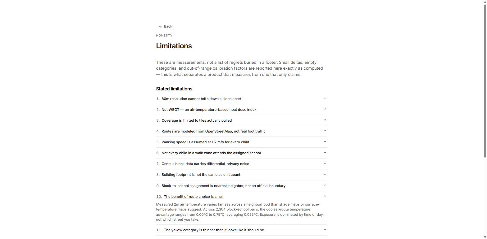

Entry 10, "The benefit of route choice is small," expanded — reports the actual measured range (0.00°C–0.75°C, averaging 0.055°C across 2,304 block–school pairs) instead of rounding it up. This is the finding CLAUDE.md calls out by name as something that must be reported honestly, not hidden.

---

## Verified but not screenshotted

**CSV export (FR-14).** Clicked live during this pass (with explicit go-ahead, since it triggers a real download): `sch_maynard_evans_high-reclassification.csv` downloaded to the Downloads folder, 750 data rows plus header, columns `block_id, kids_est, status_now, status_rec, coolest_mean_c, coolest_mean_f, dose, days_exceedance_per_year, reason`. Not included as an image since a file-save dialog / Explorer window isn't a meaningful screenshot of the *feature* — the button itself is visible in screenshot 08, and the schema is confirmed correct here in text.

**Petition "Copied" state.** Clicking the button in screenshot 04 calls `navigator.clipboard.writeText` (`components/PetitionButton.tsx`); in the automated browser this Promise never resolved (no clipboard permission granted to the automation context), so the `Copied` label swap never fired on screen. The code path was inspected directly and is a plain async clipboard write with a 2-second timeout reset — nothing more exotic is happening; a normal user click in a permitted tab would show the label change. Not a product bug, a demo-environment limitation.

## Specified but not implemented

**FR-17 — Refresh forecast.** No refresh/re-fetch control exists anywhere in `web/src` at the time of this pass. `TileCoverageInfo.tsx` reads `tiles.json` to show fetch metadata (visible in the "Tile orl_ocps_core · fetched 2023-08-08 · hours..." line in screenshots 08–17) but there is no button that triggers a live API call. Per the dev plan this is the first item in the "cut if time runs out" list (P1), so its absence is consistent with the stated priority order, not an oversight — flagging it here so it isn't silently assumed to exist.

## Environment note

No console errors were observed on initial load of either `/` or `/district`, checked via the browser's console log after the first full render.
