# HeatWalk — rekam screenshot pasca-redesign panel mengambang

Diambil 2026-08-27 terhadap build dev lokal (`npm run dev`, Vite di `localhost:5173`) dengan data fixture yang sudah tersedia di `web/public/data/` (6 sekolah OCPS teranalisis: Maynard Evans High, Rolling Hills Elementary, Meadowbrook Middle, Ridgewood Park Elementary, Rosemont Elementary, UCP Pine Hills Charter — jam 07:00–16:00, `canonical_hour` 15:00, `baseline_c` 33.0°C, `threshold` 110°C·min, `fetched_at` 2023-08-08) dan basemap self-hosted `web/public/heatwalk-aoi.pmtiles`. Tidak ada file source yang diubah untuk menghasilkan pass ini — setiap gambar adalah aplikasi apa adanya hari ini, desktop saja (viewport diminta 1440×900).

**Kenapa pass ini ada.** `docs/screenshots-old/` merekam UI **sebelum** redesign 2026-08-27 (header persisten 48px + tiga kolom penuh-tinggi di Mode 1). Sejak itu `DESIGN.md` mencatat keputusan produk: header dibubarkan, peta jadi full-bleed di seluruh viewport, dan seluruh produk dioperasikan dari **satu panel mengambang 380px** (inset 16px) plus **cluster kontrol** kecil di kanan atas (collapse panel · switch Parent/District · toggle Hide heat data · toggle tema). Mode distrik tidak lagi tiga kolom — sekarang **tumpukan tiga tampilan** (daftar sekolah → sekolah terpilih → blok terpilih) yang saling menggantikan lewat tombol kembali. Folder lama diganti nama jadi `docs/screenshots-old/`, tidak dihapus, tidak diedit; folder ini (`docs/screenshots/`) adalah rekam baru dari nol.

Catatan teknis pengambilan: dua penempatan pin presisi (blok merah di screenshot 02/05, titik luar AOI di 04) dan satu klik blok di peta (11) dilakukan dengan menghitung posisi piksel lewat `map.project()` pada instance MapLibre yang sama yang dipakai aplikasi (diperoleh lewat monkey-patch sesaat pada `Map.prototype.fire`, bukan lewat backdoor terpisah), lalu men-drag marker/mengklik lewat mouse sungguhan — `dragend` dan `click` handler aplikasi sendiri yang menjalankan seluruh perubahan state, persis seperti drag manual pengguna. Resolusi capture layar berfluktuasi sepanjang sesi (kadang 1568×772 sama dengan 1:1 CSS px, kadang lebih kecil dari viewport 1920×945 sebenarnya) — ini kuirk alat tangkap-layar, sudah diverifikasi lewat `getBoundingClientRect()` bahwa layout DOM (lebar panel tetap 380px, font-size dasar 16px) tidak pernah benar-benar berubah. Tidak memengaruhi kebenaran state yang direkam, hanya framing visual antar-gambar yang tidak seragam.

---

## Mode orang tua (`/`)

### 01 — Panel default
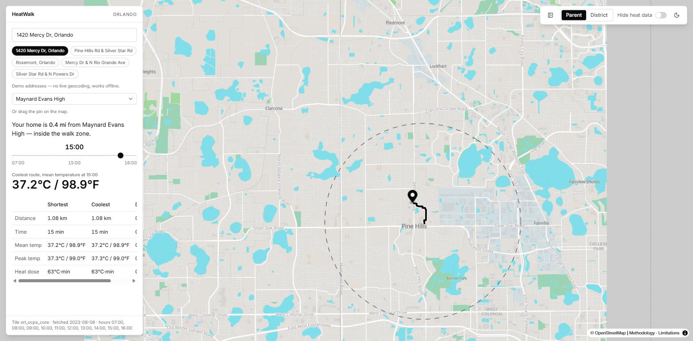

Alamat demo `1420 Mercy Dr, Orlando` terhadap Maynard Evans High. Panel samping tunggal (bukan header + kolom terpisah lagi): baris atas `HeatWalk` / `ORLANDO`, lalu berurutan ke bawah — input alamat + 5 chip alamat demo (**FR-1**), `SchoolSelect`, kalimat status "Your home is 0.4 mi from Maynard Evans High — inside the walk zone" (**FR-2**), hour slider di 15:00 (**FR-13**), tabel perbandingan rute (**FR-4**: 1.08 km, 15 min, mean 37.2°C/98.9°F, peak 37.3°C/99.0°F, dosis 63°C·min — shortest dan coolest identik untuk alamat ini), footer `Tile orl_ocps_core · fetched 2023-08-08`. Peta terlihat penuh di keempat sisi panel, batas walk-radius (garis putus-putus) tergambar di sekitar sekolah (**FR-7**).

### 02 — Blok merah: tanpa rute aman + petisi
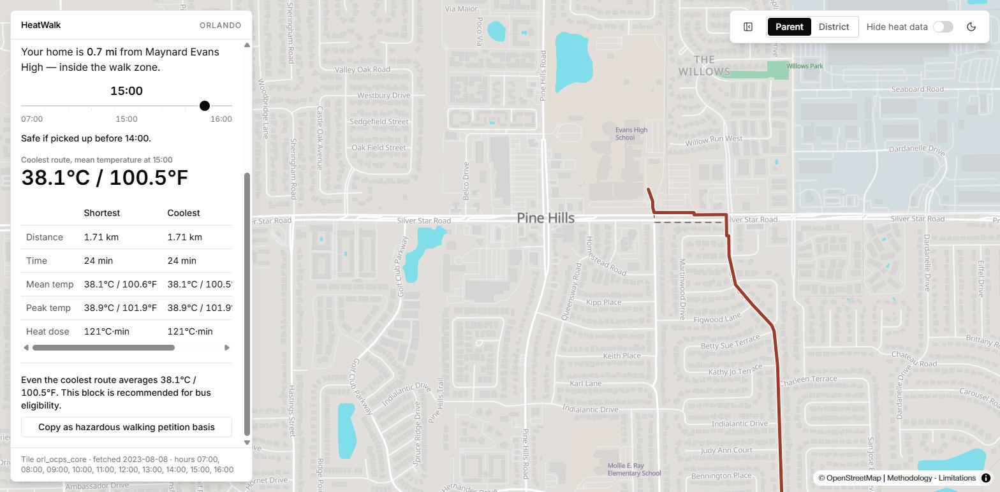

Pin dipindah ke blok yang diklasifikasikan **merah** oleh pipeline (`sch_maynard_evans_high`, block `120950120002004`, `status_rec: bus_eligible`), 0.7 mi dari sekolah. Panel di-scroll untuk menunjukkan `SafeUntilLine` ("Safe if picked up before 14:00", turunan **FR-8**), dosis rute teradem 121°C·min pada 15:00 (38.1°C/100.5°F), kalimat "Even the coolest route averages 38.1°C / 100.5°F. This block is recommended for bus eligibility.", dan tombol **Copy as hazardous walking petition basis** (**FR-5**). Rute tergambar merah di peta. Ini kasus yang CLAUDE.md tandai tidak boleh dipotong — kategori merah dengan hasil terisi penuh.

### 03 — Slider jam mengubah angka secara langsung

Pin blok merah yang sama, slider digeser ke 07:00 lewat keyboard (`Home`, bukti slider dapat dioperasikan penuh dengan keyboard). Mean temperature turun dari 38.1°C/100.5°F (15:00) jadi 28.5°C/83.3°F, dosis jadi 0°C·min — konfirmasi **FR-13** benar-benar menghitung ulang panel. Kalimat "Safe if picked up before 14:00" dan teks petisi tetap menampilkan angka 15:00 yang sama — ini bukan bug: kedua field itu adalah bukti tetap (`safe_until_hour`, dosis kanonis) dari data blok, bukan yang di-recompute per slider, dan memang seharusnya tidak berubah saat jam digeser.

### 04 — Di luar AOI
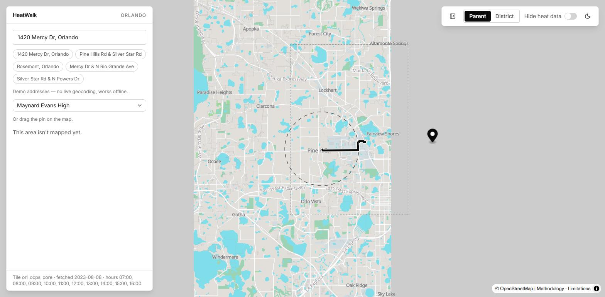

Pin digeser jauh ke timur, keluar dari bbox tile `orl_ocps_core`. Kotak putus-putus batas AOI dan lingkaran putus-putus walk-radius tetap tergambar benar, basemap di luar kotak jadi abu-abu polos (tidak ada tile), dan panel menampilkan **"This area isn't mapped yet."** (`OutOfAoiNotice`) alih-alih menebak — konfirmasi cakupan AOI menjaga kejujuran UI.

### 05 — Hide heat data (FR-16)
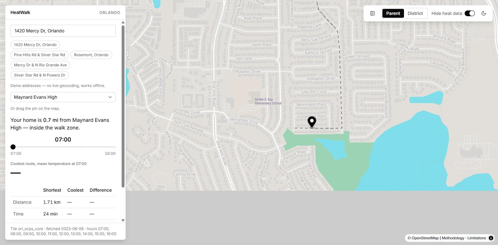

Pin blok merah yang sama, "Hide heat data" diaktifkan dari cluster kontrol kanan atas. Rute berwarna di peta hilang, baris "Coolest route, mean temperature" kosong, kolom Coolest/Difference di tabel jadi em dash, `SafeUntilLine` dan tombol petisi hilang total. Baris yang tidak bergantung pada data panas (Distance 1.71 km, Time 24 min) tetap tampil — konfirmasi FR-16 hanya mematikan yang berbasis suhu, bukan seluruh panel.

### 06 — Panel collapsed (state baru)
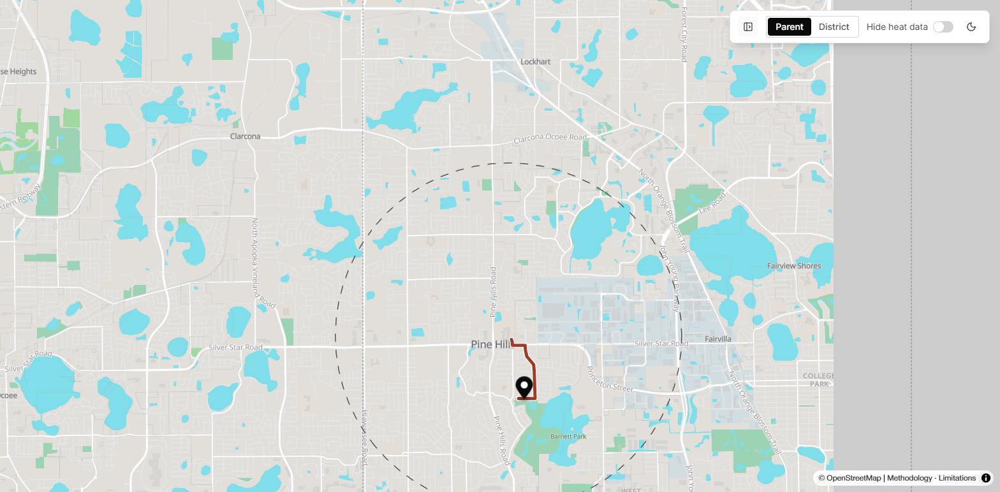

Tombol collapse di cluster kontrol diklik. Panel hilang total, peta mengisi seluruh viewport, cluster kontrol (Parent/District · Hide heat data · tema) tetap terjangkau di kanan atas. Ini state yang tidak ada sebelum redesign.

### 07 — Tema gelap
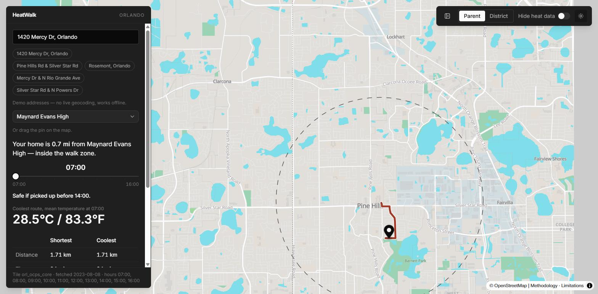

Toggle tema diklik. Panel, teks, dan cluster kontrol berbalik ke gelap dengan benar. Basemap tetap tema terang di kedua mode (`lib/basemapStyle.ts` mengunci `namedTheme('light')`) — ini keterbatasan nyata yang sudah didokumentasikan, bukan artefak screenshot.

---

## Mode distrik (`/district`)

### 08 — Tampilan 1: daftar sekolah
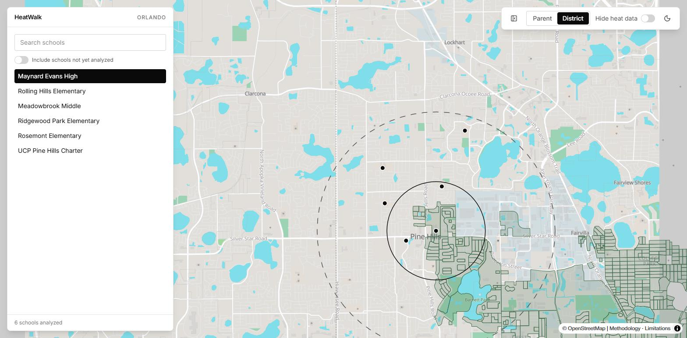

Tampilan default panel distrik: input pencarian kosong, switch "Include schools not yet analyzed" (off), daftar 6 sekolah teranalisis dengan Maynard Evans High terpilih (baris hitam), footer "6 schools analyzed". Peta menampilkan poligon walk-zone resmi (hijau), zona dosis panas berpola garis-garis merah, lingkaran radius setara-dosis, dan titik-titik sekolah nasional di sekitarnya.

### 09 — Tampilan 2 atas: sekolah terpilih
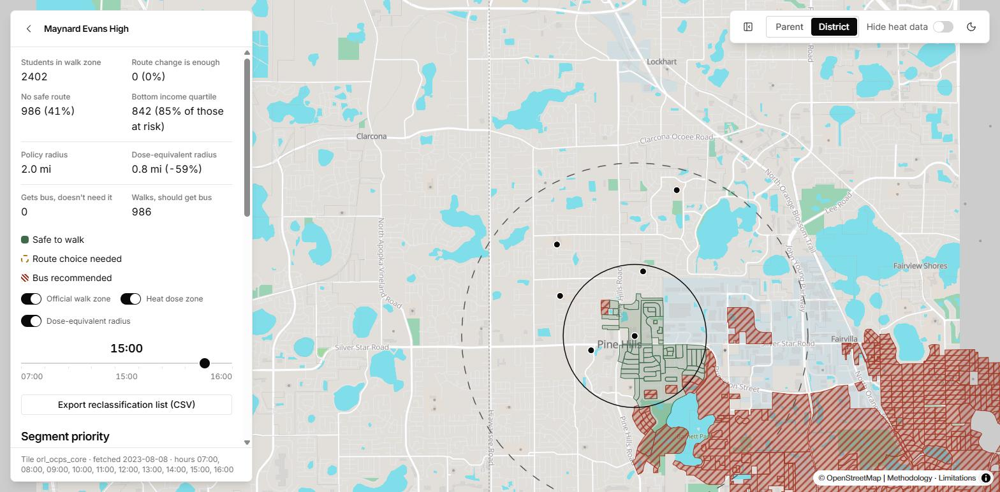

Klik Maynard Evans High → tombol kembali + nama sekolah di baris atas panel. `SchoolSummaryRow` sekarang **grid metrik dua kolom** (**FR-12**, bukan baris horizontal): Students in walk zone 2402, Route change is enough 0 (0%), No safe route 986 (41%), Bottom income quartile 842 (85% of those at risk), Policy radius 2.0 mi, Dose-equivalent radius 0.8 mi (−59%, **FR-18**), Gets bus doesn't need it 0, Walks should get bus 986. Di bawahnya `ZoneLegend` (**FR-8**: Safe to walk / Route choice needed / Bus recommended), tiga `LayerToggles` semua aktif, hour slider di 15:00, tombol Export CSV, dan judul "Segment priority" di bagian bawah.

### 10 — Tampilan 2 di-scroll: tabel prioritas segmen
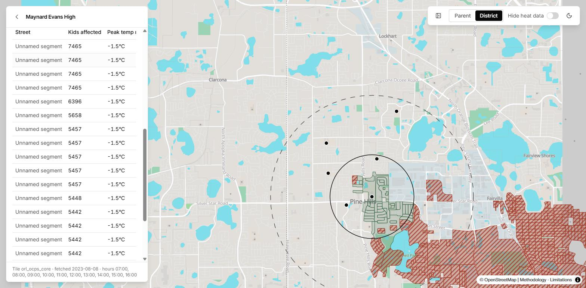

Panel di-scroll turun: header tabel `Street / Kids affected / Peak temp reduction` (**FR-15**) dengan baris "Unnamed segment" berurutan dari yang berdampak paling besar (7465 anak terdampak, −1.5°C) ke bawah — matching catatan kaki "Assumes a uniform cooling effect under full canopy shade — an estimate, not a local measurement."

### 11 — Tampilan 3: detail blok merah
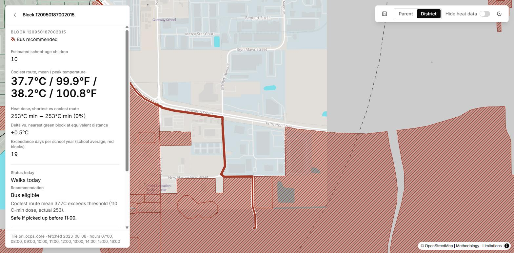

Klik blok berpola garis-garis merah di peta (zoom masuk dulu agar target dapat diklik presisi) → `Block 120950187002015` (**FR-9**). Badge "Bus recommended", Estimated school-age children 10, Coolest route mean/peak 37.7°C/99.9°F / 38.2°C/100.8°F, Heat dose shortest→coolest 253°C·min → 253°C·min (0%), Delta vs nearest green block +0.5°C, Exceedance days per school year 19, Status today "Walks today", Recommendation "Bus eligible", alasan "Coolest route mean 37.7C exceeds threshold (110 C-min dose, actual 253)," Safe if picked up before 11:00. Rute teradem tergambar merah di peta (**FR-10** — "lihat kenapa": bahkan rute terbaik pun tidak menolong).

### 12 — Tampilan 3 di-scroll: panel outcome
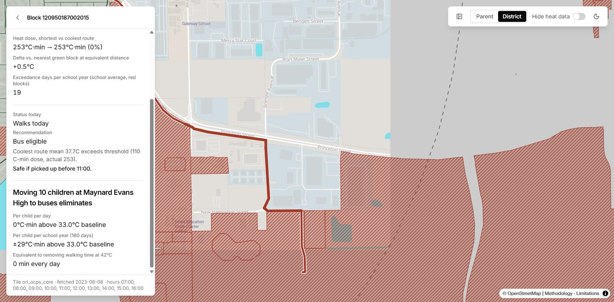

Scroll ke bawah dalam panel blok yang sama: blok **"Moving 10 children at Maynard Evans High to buses eliminates"** (**FR-11**) — Per child per day 0°C·min di atas baseline 33.0°C (0 karena jam slider saat ini, 16:00, berada di bawah ambang untuk rute tersebut), Per child per school year ±29°C·min di atas baseline (agregat 180 hari), dan setara "0 min every day" waktu jalan kaki pada 42°C yang dihilangkan.

### 13 — Slider jam mereklasifikasi blok secara langsung
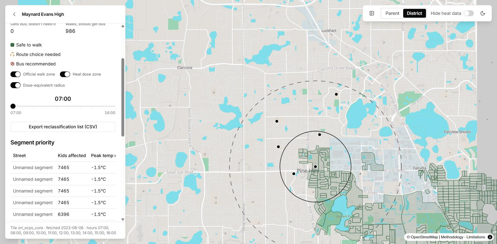

Kembali ke tampilan sekolah, slider digeser ke 07:00 lewat keyboard. Blok yang tadinya berpola garis-garis merah di sekitar Pine Hills berubah jadi hijau — konfirmasi **FR-13** menggerakkan layer choropleth, bukan sekadar angka panel.

### 14 — Layer toggle: dose-equivalent radius mati
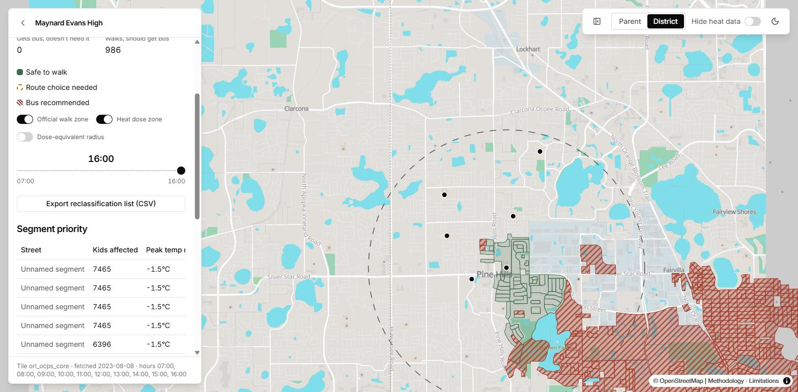

Toggle "Dose-equivalent radius" dimatikan (slider jam berada di 16:00, ujung kanan). Lingkaran hitam radius hilang; poligon walk-zone resmi dan blok berpola garis-garis merah tetap tampil — konfirmasi tiga layer toggle independen (**FR-18** render), bukan satu saklar gabungan.

### 15 — Pencarian sekolah dengan sekolah belum teranalisis
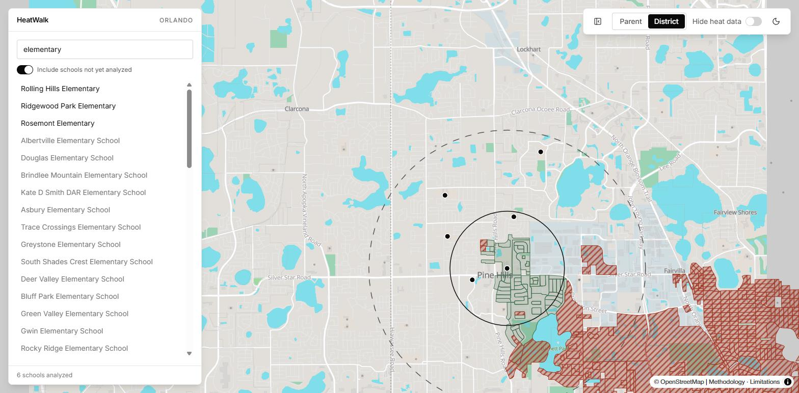

Ketik "elementary" dengan "Include schools not yet analyzed" aktif. Baris tebal (Rolling Hills, Ridgewood Park, Rosemont Elementary) adalah tiga sekolah dasar teranalisis; baris polos di bawahnya (Albertville, Douglas, Brindlee Mountain, Kate D Smith DAR, Asbury, dan seterusnya — daftar jauh lebih panjang dari sekadar tiga) adalah sekolah NCES nasional yang ditarik masuk (**FR-20**), difilter oleh teks pencarian yang sama.

### 16 — Notifikasi sekolah belum teranalisis
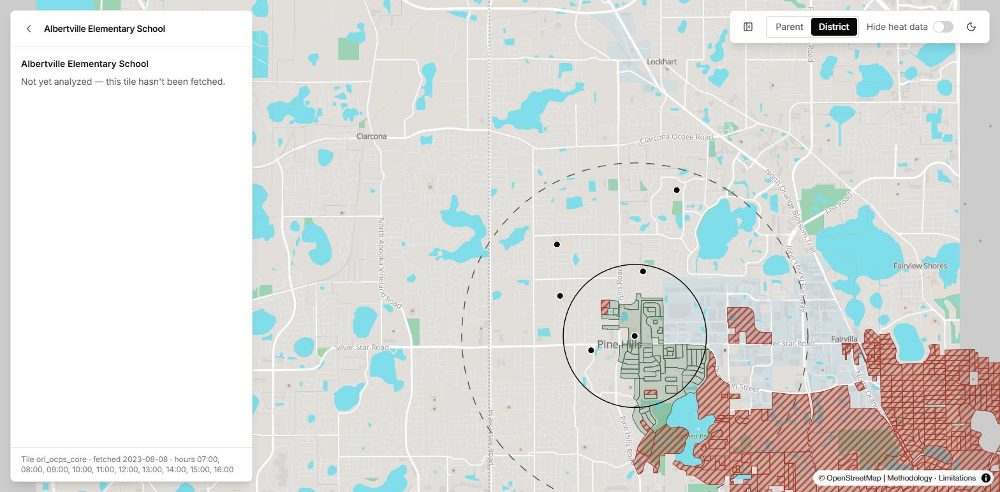

Klik "Albertville Elementary School" dari daftar tidak teranalisis. Panel detail menampilkan **"Not yet analyzed — this tile hasn't been fetched."** alih-alih mengarang angka — jaminan kejujuran untuk mayoritas sekolah AS yang hanya ada sebagai titik pin NCES.

### 17 — Hide heat data (distrik)
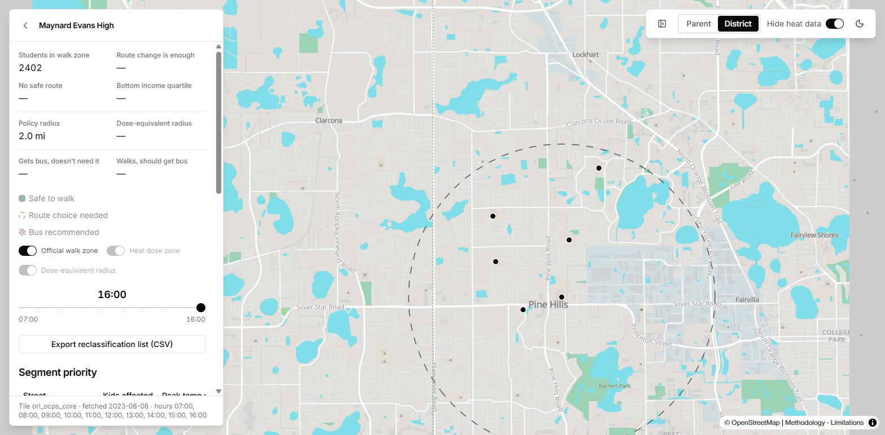

Kembali ke Maynard Evans High (state seleksi sekolah tetap tersimpan), "Hide heat data" diaktifkan. Metrik turunan panas (No safe route, Bottom income quartile, Route change is enough, Dose-equivalent radius, Gets bus doesn't need it, Walks should get bus) semuanya jadi em dash; Students in walk zone (2402) dan Policy radius (2.0 mi, bukan turunan panas) tetap tampil. Toggle "Heat dose zone" dan "Dose-equivalent radius" nonaktif dan pudar; "Official walk zone" tetap aktif. Blok berpola garis-garis merah dan lingkaran radius hilang dari peta — konfirmasi **FR-16** terhubung penuh ke seluruh tampilan distrik, bukan cuma peta.

### 18 — Panel collapsed (distrik, state baru)
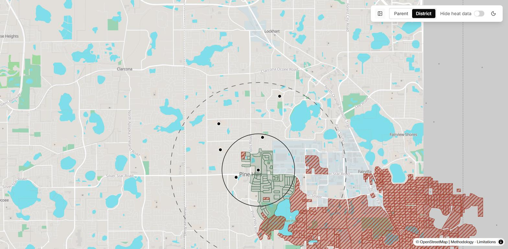

Panel disembunyikan di mode distrik. Peta kembali penuh layar menampilkan poligon walk-zone, zona dosis panas berpola garis-garis, lingkaran radius, dan titik sekolah nasional sekaligus; cluster kontrol tetap terjangkau.

### 19 — Tema gelap (distrik)
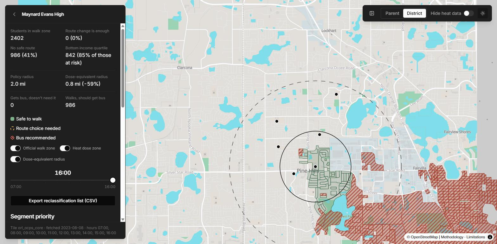

Panel sekolah Maynard Evans High yang sama, tema gelap. Seluruh teks dan grid metrik tetap terbaca; seperti di 07, basemap tetap terang di baliknya.

---

## Halaman dokumentasi

### 20 — Methodology
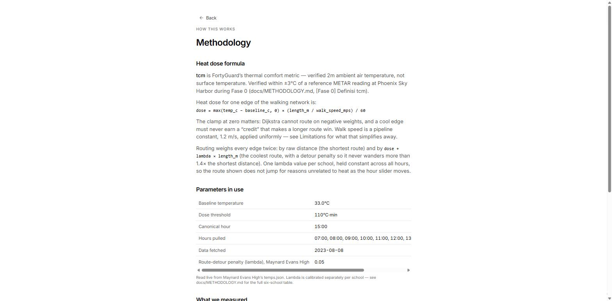

`/methodology`: rumus dosis (`dose = max(temp_c − baseline_c, 0) × (length_m / walk_speed_mps) / 60`), penjelasan bobot routing (detour penalty lambda, dibatasi 1.4× jarak terpendek), dan tabel parameter yang dibaca langsung dari `temps.json` — baseline 33.0°C, threshold 110°C·min, canonical hour 15:00, lambda 0.05 untuk Maynard Evans High.

### 21 — Limitations (tertutup)
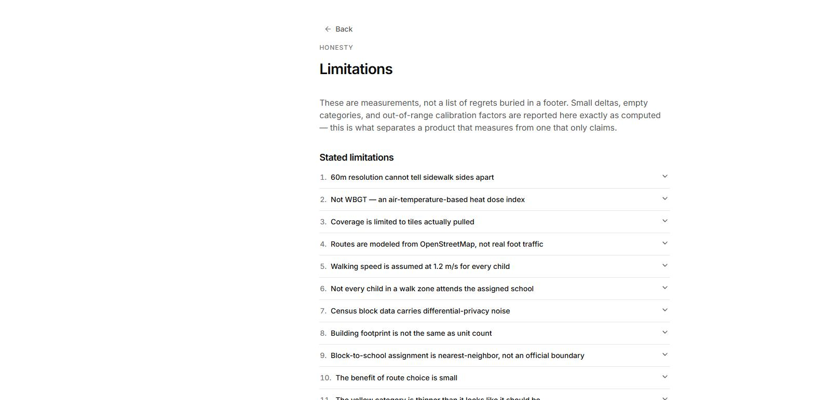

`/limitations`: akordion bernomor, minimal 15 butir keterbatasan terlihat tanpa scroll (kemungkinan lebih banyak lagi di bawahnya) — sesuai kebutuhan non-negotiable PRD untuk halaman Limitations.

### 22 — Limitations (satu butir terbuka)
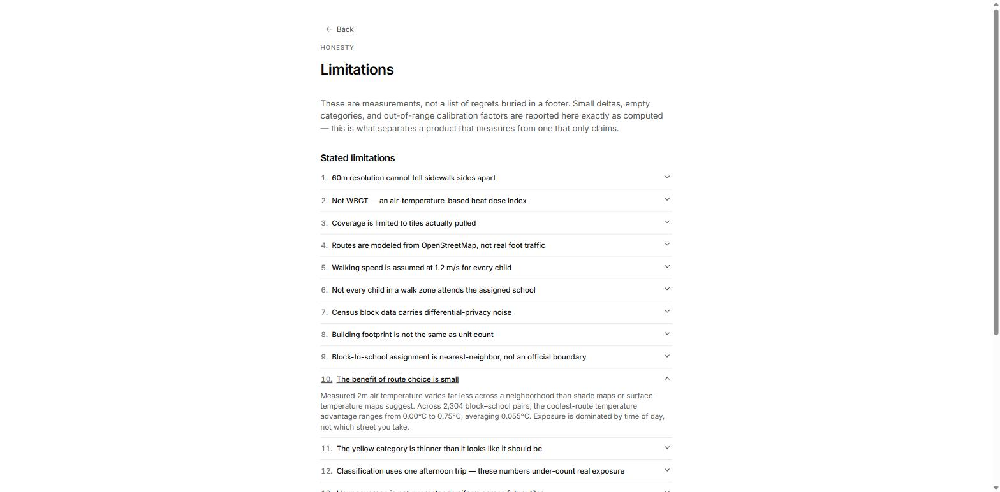

Butir 10, "The benefit of route choice is small", dibuka — melaporkan rentang terukur yang sama persis dengan pass sebelum redesign (0.00°C–0.75°C, rata-rata 0.055°C dari 2.304 pasangan blok–sekolah). Konfirmasi: redesign hanya mengubah tata letak UI, data pipeline di baliknya tidak berubah.

---

## Hasil quality check terhadap `DESIGN.md` (baris 266–285)

- **Peta terlihat di keempat sisi panel, tidak ada bar opaque penuh-lebar.** Lulus — terlihat konsisten di semua screenshot panel-terbuka (01, 09, 11, dst).
- **Collapse panel mengembalikan peta penuh, cluster tetap terjangkau.** Lulus — lihat 06 dan 18.
- **Panel samping tetap 380px, tidak melebar.** Lulus, diverifikasi lewat `getBoundingClientRect()` langsung di DOM (`width: 380`) pada beberapa titik sepanjang sesi, termasuk setelah collapse/expand berulang.
- **Warna hanya di peta, legend, dan badge status.** Lulus secara visual — panel, tombol, teks semuanya monokrom; warna cuma muncul di choropleth peta, lingkaran radius, `ZoneLegend`, dan badge "Bus recommended"/dsb.
- **Slider jam: 10 tanda (sesuai `meta.hours`), jam aktif besar di atas track, hanya endpoint + jam aktif berlabel.** Lulus untuk label endpoint dan jam aktif besar (terlihat di semua screenshot slider); jumlah tick individual tidak bisa dipastikan dari resolusi screenshot, tidak diverifikasi piksel-per-piksel.
- **Slider dapat digeser penuh dengan keyboard.** Lulus — dibuktikan langsung: klik thumb lalu `Home`/`End` berhasil memindahkan jam ke ujung slider di shot 03, 13, dan 14 tanpa drag mouse.
- **Berpindah `/` ↔ `/district` tidak me-remount peta.** Lulus secara tidak langsung — instance MapLibre yang sama (dipegang lewat referensi JS) tetap merespons setelah navigasi client-side ke `/district`, `/methodology`, dan `/limitations` tanpa perlu diambil ulang.
- **Setiap °C·menit didampingi °C; setiap angka headline didampingi °F.** Sebagian besar lulus — Mean/Peak temperature selalu tampil sebagai pasangan °C/°F di baris yang sama. Baris "Heat dose" sendiri hanya menampilkan °C·min tanpa °C di baris yang identik, tapi baris Mean/Peak tepat di atasnya pada tabel yang sama menyediakan padanan °C — sesuai semangat aturan meski tidak baris-demi-baris. Tabel "Segment priority" (kolom Peak temp reduction, mis. "−1.5°C") tidak punya padanan °F — ini angka delta di tabel data, bukan angka headline, jadi kemungkinan di luar cakupan aturan; dicatat sebagai temuan untuk diperiksa produk, bukan diperbaiki di sini.
- **`map.setPadding` mengikuti geometri panel yang tampil.** Tidak diuji langsung lewat interaksi flyTo produk — lihat catatan gap di bawah.

### Temuan tambahan (di luar checklist, ditemukan saat pass ini)

1. **Peta tidak flyTo saat memilih sekolah dari daftar.** `ParentRoute.tsx` dan `DistrictRoute.tsx` sama-sama memanggil `useFlyToSchool(map, selectedSchool, SCHOOL_FLY_TO_ZOOM)` (14.5 di Parent, 13.5 di District), tapi sepanjang pass ini peta tetap berada di framing overview AOI (zoom ~12.5) baik di kondisi awal maupun setelah mengklik "Maynard Evans High" dari daftar sekolah (shot 09). Karena sekolah yang diklik itu sudah menjadi sekolah default sejak awal (bukan pergantian ke sekolah lain), kemungkinan besar `useEffect` di `useFlyToSchool` memang tidak refire karena referensi objek `school` tidak berubah — pass ini **tidak menguji** memilih sekolah yang benar-benar berbeda (mis. Rolling Hills Elementary), jadi ini dicatat sebagai gap verifikasi, bukan bug yang dikonfirmasi. Perlu dicek manual: klik sekolah lain dari daftar dan lihat apakah peta benar-benar `flyTo` ke zoom 13.5.
2. **Dua warning sprite basemap berulang di console:** `Image "park" could not be loaded` dan `Image "school" could not be loaded` (`maplibre-gl.js`, style referensi dua ikon yang tidak ada di sprite pmtiles). Muncul konsisten di setiap load `/` dan `/district`. Tidak fatal, tidak memblokir render, tapi style basemap mereferensikan aset yang tidak dikirim — layak diperiksa apakah dua ikon ini memang dipakai atau sisa konfigurasi lama.

---

## Terverifikasi tapi tidak difoto

**CSV export (FR-14).** Diklik ulang di pass ini (dengan izin eksplisit — memicu download nyata): `sch_maynard_evans_high-reclassification.csv` masuk ke folder Downloads, **750 baris data + 1 header** (751 baris total, sama persis dengan pass sebelumnya), kolom `block_id, kids_est, status_now, status_rec, coolest_mean_c, coolest_mean_f, dose, days_exceedance_per_year, reason` — skema tidak berubah sejak redesign. Tidak disertakan sebagai gambar karena dialog save-file/Explorer bukan representasi visual yang berarti dari fitur ini; tombolnya sendiri terlihat di screenshot 09, dan skemanya sudah dikonfirmasi benar di sini secara teks.

**State "Copied" tombol petisi.** Klik pada screenshot 02 memanggil `navigator.clipboard.writeText` (`components/PetitionButton.tsx`); di browser hasil otomasi ini, Promise-nya tidak pernah resolve (izin clipboard tidak diberikan ke konteks otomasi), jadi label "Copied" tidak pernah muncul di layar. Bukan bug produk — batasan lingkungan demo, sama seperti pass sebelumnya.

## Tidak difoto pass ini

**Layout bottom sheet di bawah 768px.** Keputusan eksplisit sebelum pass dimulai: fokus hanya pada viewport desktop (side panel 380px). Redesign menambahkan bottom sheet untuk mode distrik (sebelumnya desktop-saja), dan perilaku itu belum diverifikasi visual di pass ini.

**State loading skeleton dan boot-error card.** `Skeleton className="fixed inset-x-4 top-16 h-24"` (saat data belum siap) dan kartu "Could not load HeatWalk data. Reload to try again." (saat boot gagal) ada di kode (`ParentRoute.tsx`, `DistrictRoute.tsx`) tapi keduanya state transisi cepat / kondisi kegagalan yang tidak dipicu selama pass normal ini.

## Ada di spesifikasi tapi belum diimplementasi

**FR-17 — Refresh forecast.** Tidak ada kontrol refresh/re-fetch di mana pun dalam `web/src`. `TileCoverageInfo.tsx` menampilkan metadata fetch ("Tile orl_ocps_core · fetched 2023-08-08 · hours...", terlihat di footer hampir semua screenshot) tapi tidak ada tombol yang memicu panggilan API langsung. `docs/METHODOLOGY.md` mendokumentasikan ini sebagai keputusan sadar (API key FortyGuard tidak boleh masuk bundle browser), konsisten dengan urutan "dikorbankan lebih dulu" di CLAUDE.md — jadi absennya ini sesuai prioritas yang dinyatakan, bukan kelalaian.

## Catatan lingkungan

Tidak ada error fatal di console pada load awal `/` maupun `/district` (dicek lewat pembacaan console browser setelah render pertama, dan lagi setelah navigasi ulang). Dua warning non-fatal tercatat di bagian "Temuan tambahan" di atas.
